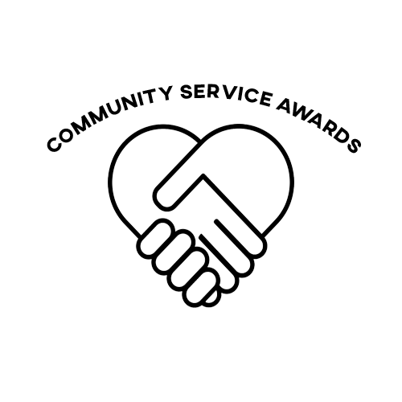

# FBLA-Community-Service-Awards
Program for the FBLA Coding & Programming event for West Leyden. This program is a Community Service made using Qt and C++ 

Link to download program: https://www.mediafire.com/file/4v5irp6lp5vzow0/CSA_West_Leyden.zip/file
# Installation Guide
1.Once on the mediafire website, click on the green "Download (26 MB)" Button

2.Extract the file

3.Read the "README.txt" file

4.Click on CommunityServiceAwards.exe

